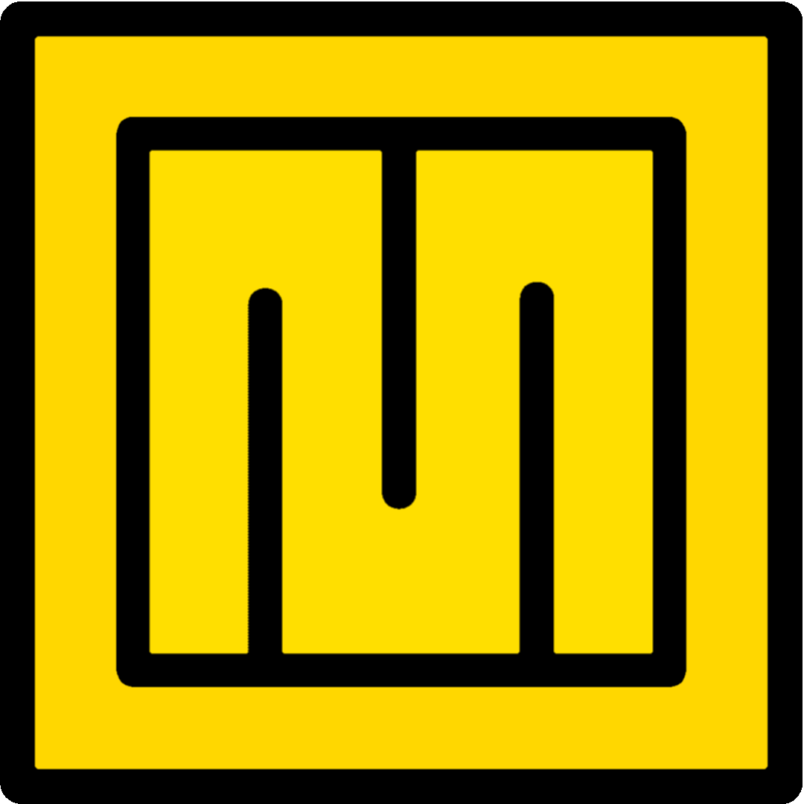

# MythOS  
[简体中文](docs/README_ZH.md)  

<br>

- A modern operating system with x86-64 architecture based on UEFI.
- Copyright (c) 2025 MythOS Project.
- All rights reserved.
---
## Tools
- mingw64 gcc
- x86_64-elf-tools
- qemu-system-x86_64
- GNU Make
---
## Compile
#### If you want to compiler but not run it, you can type:
```
make all
```
#### Then you will get some object files, one EFI file and one elf file.
---
## Run
#### If you want to compile MythOS and run it, you can type:
```
make run
```
#### Then you can compile MythOS and run it in QEMU.
---
## Boot from real machine
### Tip: The premise is that you have a real machine and it supports UEFI.And you need an empty USB flash drive.
- Format the USB flash drive to FAT32.
- Copy the 'EFI' folder and the 'kernel.elf' file in the 'esp' folder to the USB flash drive.
- Boot your real machine with the USB flash drive.
- Then you will see the screen of MythOS.
---
## Code Line
- Total : 32 files, 6046 codes, 1164 comments, 275 blanks, all 7485 lines
---
