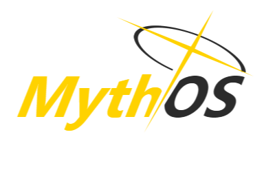

# MythOS
<br>
- A modern operating system with x86-64 architecture based on UEFI.
- Copyright (c) 2025 MaxSinoh & LuoYuDian.
- All rights reserved.
---
## Tools
- mingw64 gcc
- x86_64-elf-tools
- qemu-system-x86_64
---
## Compile
### Tip: The premise is that there is a 'bin' folder in your directory.
If you want to compiler but not run it, you can type:
```
make all
```
Then you will get some object files, one EFI file and one elf file.
---
## Run
### Tip: The premise is that there is a 'esp' folder in your directory and there is a 'EFI' folder in 'esp', and then there is a 'BOOT' folder in 'EFI'.
If you want to compile MythOS and run it, you can type:
```
make run
```
Then you can compile MythOS and run it in the QEMU.
